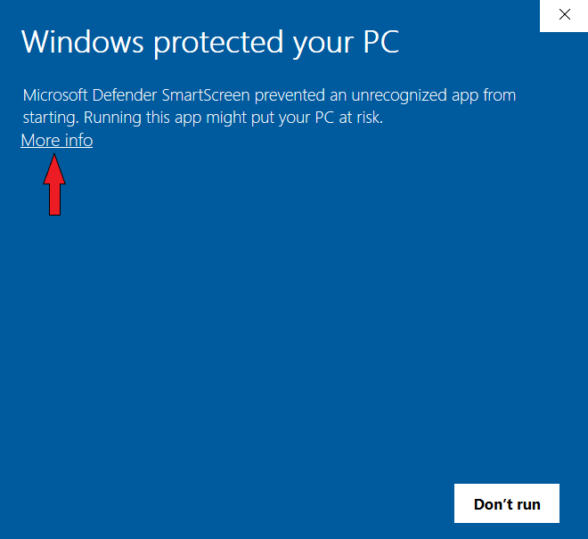

# WeatherApp

# Download

[Latest Release (.msi)](https://ilkeozs.info/weather_app/WeatherApp%20Installer.msi)

# Installation Warnings

The warning seen in the photo below is normal.

After these steps, you will see the standard installation window.
