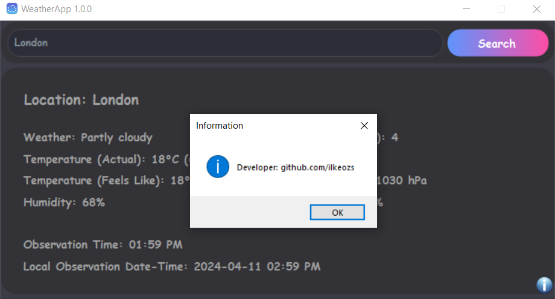

# WeatherApp

# Downloads

[Latest Recommended Release (.msi)](https://drive.google.com/uc?id=1JlY_ULa6YQahpvY022B9vQDzW3zHQml4)

[Latest Release (.exe)](https://drive.google.com/uc?id=1JVoE79gJ1nAof3rv_ujF3QN9gl1JokXl)

Note: In order to run the exe file, the msi file must be downloaded and be in the same place as the exe file.

# Download and Installation Warnings

The warnings seen in the photos below are normal. The download and installation process for the exe file is the same.

After these steps, you will see the standard installation screen.
